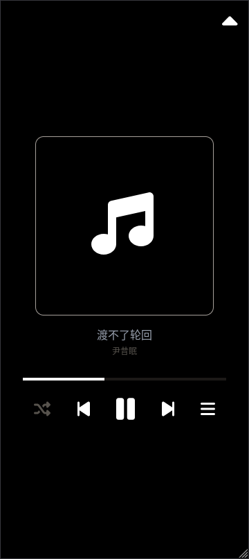
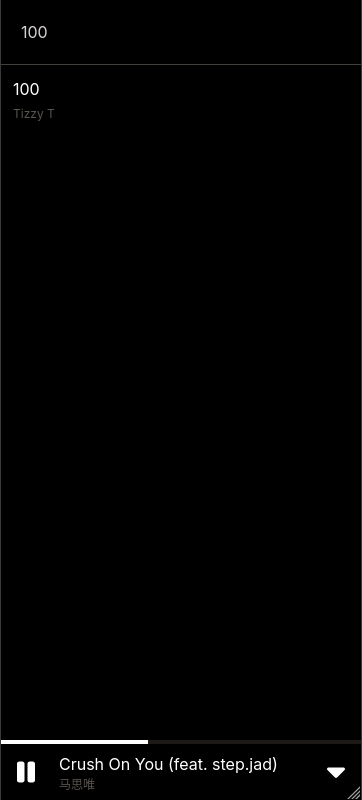

# (WIP) A music player written in Angular and Rust

## env files
Environment files should look like this:
<br>
Frontend: create a file called 'env.ts' in the folder "front/src/environments/"
```ts
export const env = {
    apiUrl: "<api url>" // Backend url
}
```
Backend: file called .env in the root of backend
```console
ROCKET_ADDRESS="<server address>" // most likely localhost (e.g.,'127.0.0.1'), excluding 'http://' and port
MUSIC_FOLDER="<folder containing songs>"
```

### Preview
<div float="left">
    
    
    
</div>


### TODO:
- Song queue
- Audio visualizer
- Spotify/Youtube/Soundcloud integration?
